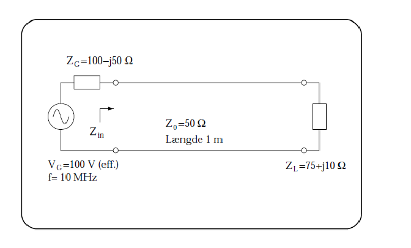

### Exercises:

**Exercise 10.1**
Calculate the following quantities for the setup shown in the figure below, and provide them with the
correct units. The cable is 1 m long. It is lossless, and the phase propagation constant is $1.5 \pi rad/m.$

a. Calculate KL in polar form.
**Answer:**
$$
\begin{align*} 
K_L = \frac{Z_L-Z_0}{Z_L+Z_0} = \frac{75+j10 - 50}{75+j10 + 50} = \frac{25+j10}{125+j10}\\ = 0.205+j0.063 = 0.214 \angle17.12\degree\\ 
\end{align*}
$$

b. Calculate the reflection coefficient K(-l) in polar form.
**Answer:**
$$ 
\begin{align*}
k(-l)= K_L\cdot e^{-j2\cdot\beta\cdot l} = 0.214 \angle17.12\degree \cdot e^{-j2\cdot 1.5\cdot \pi \cdot 1} = 0.214 \angle -162.7\degree
\end{align*}
$$

c. Calculate the input impedance Zin in rectangular form.
**Answer:**

$$
\begin{align*}
Z_{in}=Z(-l)=Z_o\cdot \frac{1+k(-l)}{1-k(-l)}\hspace{1cm}[\Omega] \\
Z_{in} = 50\cdot \frac{1+ 0.214 \angle-162.7\degree}{1-0.214 \angle -162.7\degree} = 32.75 - j4.366\:[\Omega]
\end{align*}
$$

d. Calculate the voltage at the input of the cable.
**Answer:**

$$
\begin{align*}
V(-l) = V_G \cdot \frac{Z(-l)}{Z_G+Z(-l)} \\
V(-l) = 100 \cdot \frac{32.75-j4.366}{100-j50+32.75-j4.366} \\= 22.281 + j5.835\hspace{0.1cm}V
\end{align*}
$$

e. Calculate the current flowing into the cable.
**Answer:**

$$ I = \frac{V(-l)}{Z_{in}} = \frac{22.281 + j5.835}{32.75-j4.366} = 0.645 + j0.263\hspace{1cm} [A] $$

f. Now, remove the generator including the generator impedance. Calculate which component should be connected at the input of the cable to make the impedance purely real.
**Answer:**
The input is capacitive where a inductor is required to cancel that part out.
Due to inductors and capacitors having opposite signs.
Since the coupling will be in parallel the impedance must be converted to admittance instead.
$$Y_{in} = \frac{1}{Z_{in}} = \frac{1}{32.75-j4.37} = 30 + j4 mS$$
$Y_{komp}$ then must be $-j4 mS$
$$B_{Li}= \frac{1}{\omega L} \Rightarrow L = \frac{1}{\omega B_L}\\
L = \frac{1}{2\pi\cdot10E6\cdot 4E-3} = 3.98 \mu H$$