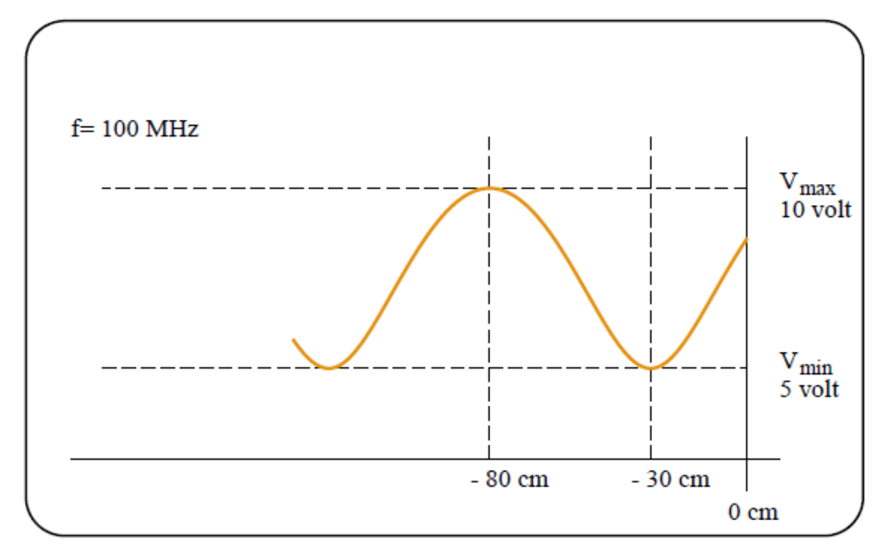

# High speed electronics in practice - exercises for lecture 11

## Exercise 11.1

We consider a transmission line setup where the load $Z_L$ consists of $95 \mathrm{\Omega}$ in series with 24 pF.
The characteristic impedance of the cable is $50 \mathrm{\Omega}$, and it is lossless. The frequency is 100 MHz.
In this exercise, we need to determine the standing wave curve for the current. We assume the incident current wave is 1 A (peak).

a. Calculate the load impedance and express it in rectangular form.

$$
Z_L = R + \frac{1}{j\omega C} = 95 - j66.31 \: [\mathrm{\Omega}]
$$

b. Calculate $K_L$ and express it in polar form.

$$
K_L = \frac{Z_L - Z_0}{Z_L + Z_0} = 0.502 \angle - 31.63 \: [\mathrm{\degree}]
$$

c. Calculate the maximum and minimum currents on the cable.

$$
I_\mathrm{max} = I^+ (1 + |K_L|) = 1.502 \: [\mathrm{A}] \\
I_\mathrm{min} = I^- (1 - |K_L|) = 0.498 \: [\mathrm{A}] \\
I^+ = 1 \: [\mathrm{A}]
$$

d. Calculate the current through $Z_L$.

$$
I_{L} =I^+ |1-K_L| = 0.625 \: [\mathrm{A}]
$$

e. Calculate the distance from the load to the first current maximum, given in
"wavelengths," and sketch the standing wave curve from the load to half a
wavelength towards the generator.

The phase shift $\varphi$ is calculated:
$$
\varphi = 180\degree + \angle K_L = 180\degree - 31\degree = 149\degree
$$

A $360\mathrm{\degree}$ phase shift corresponds to $\lambda/2$.

Thus, the phase shift $\varphi$ corresponds to a distance of
$$
d = x = \frac{\varphi}{360\degree} \cdot \frac{\lambda}{2} = 0.207 \lambda
$$

## Exercise 11.2

On a lossless cable with a characteristic impedance of $50 \mathrm{\Omega}$, the following standing wave curve for voltage
has been measured. The distance from the load to the first voltage minimum is 30 cm, and the distance
from the load to the first voltage maximum is 80 cm. The maximum voltage is 10 V (peak), and the
minimum voltage is 5 V (peak). The frequency is 100 MHz.

a. Determine the standing wave ratio (SWR), the magnitude of the reflection coefficient $K_L$, and the wavelength on the cable.

$$
\mathrm{SWR} = \frac{V_\mathrm{max}}{V_\mathrm{min}} = 2 \: [\cdot]
$$

$$
|K_L| = \frac{\mathrm{SWR} - 1}{\mathrm{SWR} + 1} = \frac{1}{3}\: [\cdot]
$$

Since the wave shown in the figure is a standing wave, the wavelength of the standing wave, $b$ can be found to be 1 m.
$$
\lambda = 2 b = 2 \:[\mathrm{m}]
$$

b. Determine $K_L$ and the value of the load impedance $Z_L$.

$$
\angle K_L = 720\degree \cdot \frac{0.3}{2} = 108 \degree
$$

Thus, $K_L$ is
$$
K_L = \frac{1}{3} \angle 108\degree
$$

$$
Z_L = Z_0 \frac{1 + K_L}{1 - K_L} = 60.32 \angle -36\degree = (49.10 - j35.03) \,\mathrm{\Omega}
$$

c. Provide two possible realizations of $Z_L$ (one in series and one in parallel).

1. Resistor with series capacitor

$$
R = 49.1 \: [\mathrm{\Omega}] \\
C = 45.43 \: [\mathrm{pF}]
$$

2. Resistor with parallel inductor

d. Calculate the amplitude of the incident voltage wave and the amplitude of the voltage across the load.
