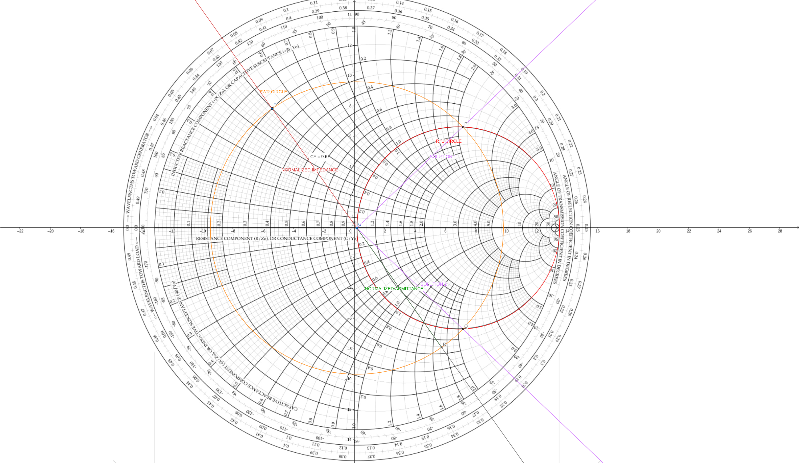
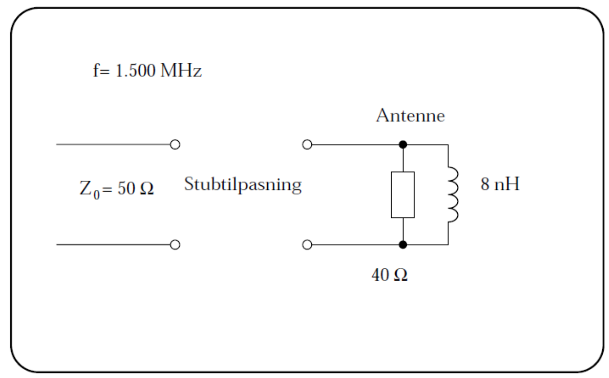

# High speed electronics in practice - exercises for lecture 12

## Exercise 12.1

In this exercise, we use lossless $50\,\mathrm{\Omega}$ cables with v = 196E6 m/s.
The two elements in a stub matching are referred to as the stub and the line.

a. Perform a single stub matching for a load consisting of $10\,\mathrm{\Omega}$ in series with 27 nH to a $50\,\mathrm{\Omega}$ cable at a frequency of 150 MHz.
Provide the lengths in both degrees and meters. Use the shortest line and an open stub.

Start by calculating and normalizing $Z_L$:
$$
Z_L = 10 + j 2\pi \cdot 150\cdot10^6 \cdot 27 \cdot 10^{-9} = (10 + j25.45) \:[\mathrm{\Omega}] \\
Z_N = \frac{10 + j25.45}{50} = 0.20 + j 0.51
$$

Draw with the [best tool](https://www.geogebra.org/classic/deszxyd4)

The admittance (mirrored impedance) is at
$$
Y_N = \frac{1}{Z_N} = 0.67 - j1.70
$$

This corresponds to $0.326\lambda$. We add $0.36\lambda$ to get to $0.19\lambda$ which is $1+j2.1$.
So, the transmission line length is $0.36\lambda$.

We now must match the imaginary component.
This means we must add $-j2.1$ to match the imaginary component.
This matches $0.311\lambda$, so this is the length of the open stub.

b. After the matching is done, what is the SWR on the stub, the line, and the cable?

$$
\mathrm{SWR} = \frac{1+|K_L|}{1-|K_L|}
$$

$K_L$ is read for the stub, the line and the cable as the distance from the middle:
- Stub: 1
- Line: 0.72
- Cable: 0
These values are calculated to be
- Stub: $\infty$
- Line: 6
- Cable: 1

## Exercise 12.2
At a frequency of 1500 MHz, an antenna can be represented by an impedance equivalent to a $40\,\mathrm{\Omega}$ resistor in parallel with an 8 nH inductor.
The antenna needs to be matched to $50\,\mathrm{\Omega}$ using a single stub matching.
The matching is done using lossless $50\,\mathrm{\Omega}$ cables with C = 150 pF/m.
Use the provided Smith chart for the stub matching calculation.

a. Calculate the propagation velocity and wavelength for the cables used in the matching.
Provide the wavelength in millimeters.

b. Perform the stub matching on the Smith chart.
Use the principal solution with a short line and an open stub.
The graphical construction on the chart is considered as the solution to this question.
Draw and clearly mark each part of the construction! Choosing the wrong line and stub type (short/long, open/short) counts as an error.

c. Provide the lengths of the line and the stub in both wavelengths and millimeters.

d. Calculate the impedance of the stub.

e. If a closed stub is desired instead of an open stub, calculate the length and impedance of the closed stub.

f. Could the stub matching be done with $75\,\mathrm{\Omega}$ cables? Justify your answer.
