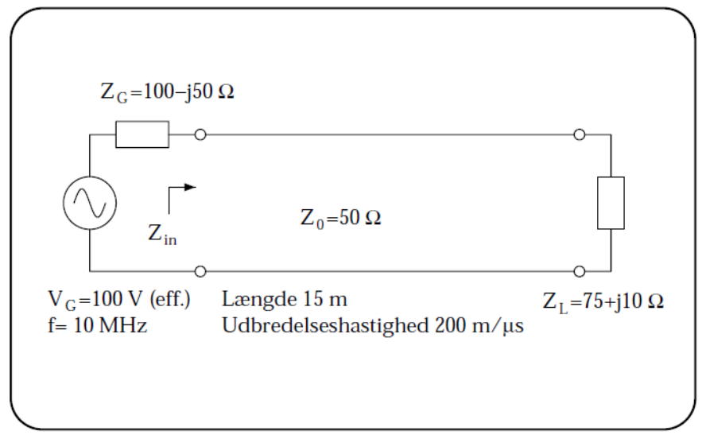

# High speed electronics in practice - exercises for lecture 13

## Exercise 13.1
Calculate the following quantities for the setup shown in the figure below and provide them with the correct units.

a. Determine the value of $Z_\mathrm{in}$.

$$
\beta = \frac{\omega}{v} = \frac{\pi}{10} \:[\mathrm{\frac{rad}{m}}]
$$

$$
K_L = \frac{Z_L-Z_0}{Z_L+Z_0} = 0.205+j0.063 \:[\cdot] \\
K(-l) = K_L \cdot \mathrm{e}^{-j2\beta l} = - 0.205 - j0.063 \:[\cdot] \\
Z_\mathrm{in} = Z_0 \frac{1+K(-l)}{1-K(-l)} = 32.8 - j4.37 \:[\Omega]
$$

b. Calculate the incident and reflected power immediately to the right of $Z_G$.

$$
V_\mathrm{in} = V(-l) = V_G \frac{Z_\mathrm{in}}{Z_\mathrm{in} + Z_G} = 22.3 + j5.84 \:[\mathrm{V}] \\
V^+ = \frac{V(-l)}{1+K(-l)} = 27.3 + j9.5 \:[\mathrm{V}] \\
P^+ = \frac{|V^+|^2}{2 Z_0} = 8.36 \:[\mathrm{W}] \\
P^- = P^+ \cdot |K_L|^2 =  0.384 \:[\mathrm{W}] \\
$$

c. How much power is delivered in total from the generator into the transmission line?

$$
P_\mathrm{trans} = P^+ - P^- = 7.97 \:[\mathrm{W}]
$$

d. How much power is dissipated in $Z_L$?

Lossless cable: $P_{Z_L} = P_\mathrm{trans}$
