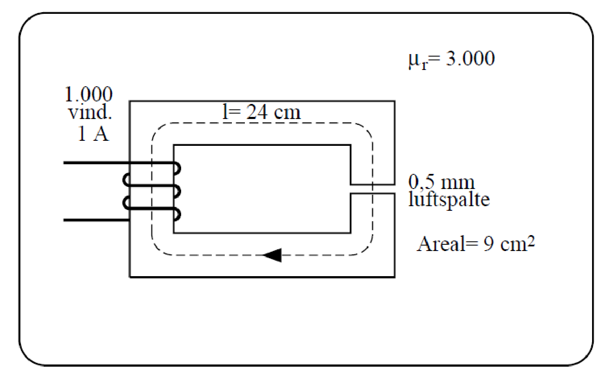

# High speed electronics in practice - exercises for lecture 1

## Exercise 3.1

Calculate the H-field and B-field at a distance of 2 m from an infinitely long straight wire, in which 1 A
(effective) alternating current is running with a frequency of 50 Hz. Use Ampere's law and give the answer
in an correct engineering manner (SI-prefixes, etc.).

$$
H_\varphi = \frac{I}{2\pi r} = \frac{1}{4\pi} \\
B_\varphi = \mu H_\varphi = 0.1 \,\mathrm{\mu Wb / m^2}
$$

## Exercise 3.2

A magnetic field is given by:
A wire goes from the point (0,7,0) to the point (7,0,1).

$$
\vec{B} = (15 \hat{i} + 15 \hat{j} - 10 \hat{k}) \,\mathrm{mWb/m^2}
$$

a. Calculate the force exerted on the wire per Ampere of current that passes through it.

Use Laplace's law.

$$
\vec{F} = I \vec{l} \times \vec{B} = (55 \hat{i} + 85 \hat{j} + 210 \hat{k}) \,\mathrm{mN/A}
$$

b. Are the magnetic field and the wire perpendicular to each other?

$$
\vec{l} \cdot \vec{B} \ne 0
$$

No, they are not perpendicular to each other.

## Exercise 3.3

Draw a magnetic equivalent circuit for the transformer core in the figure and calculate the following
quantities, assuming that the iron is linear (i.e., $\mu$ is considered as a constant):

a. The reluctance of the iron core.

$$
R_{iron} = \frac{l_{iron}}{\mu_{iron} A_{iron}} = 70.7 \,\mathrm{kH^{-1}}
$$

b. The reluctance of the air gap, taking into account a 10% increase in the gap area.

$$
R_{air} = \frac{l_{air}}{\mu_{air} A_{air}} = 402 \,\mathrm{kH^{-1}}
$$

c. The magnetic flux in the iron as well as in the air gap.

$$
F = N I = 1000 \,\mathrm{A} \\
\Phi = \Phi_{iron} = \Phi_{air} = \frac{F}{R_{iron} + R_{air}} = 2.1 \,\mathrm{mWb}
$$

