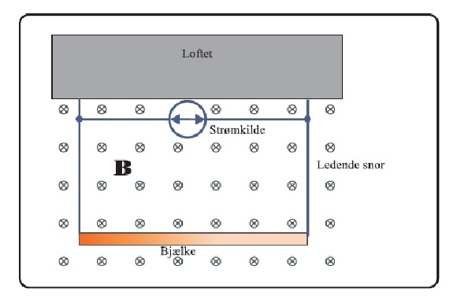
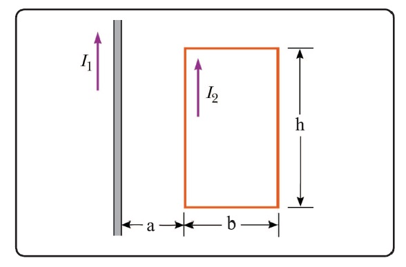
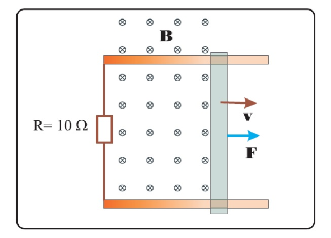
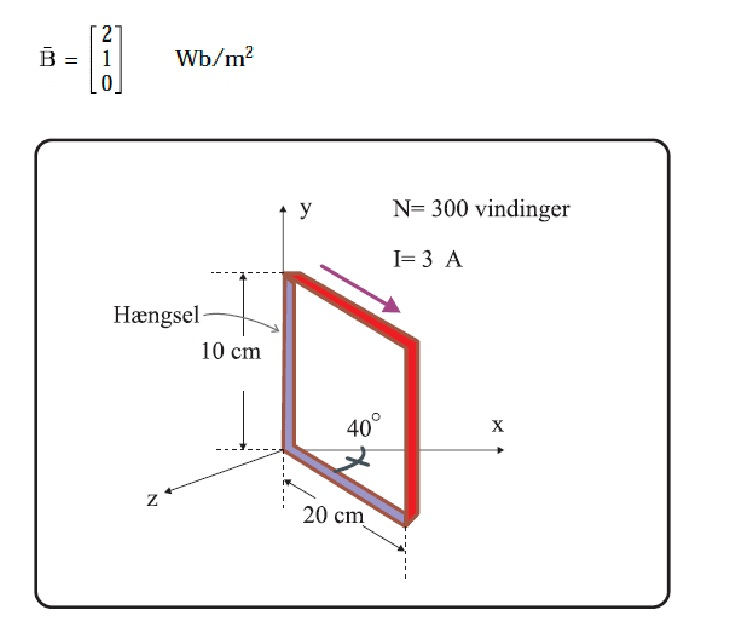

# High speed electronics in practice - exercises for lecture 5

## Exercise 5.1

A beam hangs from the ceiling by some conductive strings. There is a magnetic field present as shown in
the drawing below. By sending a current through the beam, we can get it to try to lift itself. The beam has a
weight of 400 g/m. The B-field is at $3.6 \,\mathrm{Wb/m^2}$.

a. What current is needed for the tension in the strings to become 0?

Use $F = B I l$.

$$
F_G = F_E \implies
l \frac{m}{l} g = B I l \implies
I = \frac{\frac{m}{l} g}{B}
$$
$$
I = \frac{0.4 \cdot 9.82}{3.6} = 1.1 \,\mathrm{A}
$$

b. Which way should the current flow?

Current must run to the right in the beam, so the current will be in the counterclockwise direction (left at the current symbol).

## Exercise 5.2

We have $I_1 = 5 \,\mathrm{A}$ and $I_2 = 10 \,\mathrm{A}$.
The dimensions of the loop are $a = 10 \,\mathrm{cm}$, $b = 15 \,\mathrm{cm}$, $h = 45 \,\mathrm{cm}$.

a. Find the total force on the loop.

Calculate B-field at radius $a$ and radius $a+b$.
B-fields will be into the paper.

$$
B_a = \mu_0 \frac{I_1}{2\pi a} = 10 \,\mathrm{\mu Wb/m^2} \\
$$
$$
B_{ab} = \mu_0 \frac{I_1}{2\pi (a+b)} = 4 \,\mathrm{\mu Wb/m^2} \\
$$

Use Laplace's law for the force $F=BIl$.

$$
F_a = B_a I_2 l = 45 \,\mathrm{\mu N} \\
F_{ab} = -B_{ab} I_2 l = -18 \,\mathrm{\mu N} \\
F_{tot} = 27 \,\mathrm{\mu N}
$$

Resulting force is upward (positive).

## Exercise 5.3

The figure shows a beam that can move along the two rails using ball bearings or similar without any
friction, such that there is constantly an electrical current path through the rails and the beam. The beam is
considered massless. It has a length of 7 cm. The magnetic field has a strength of $1.3 \,\mathrm{Wb/m^2}$, and the beam
moves in the direction of the arrow at 50 cm/s.

a. Determine the voltage across the resistance R, which is $10\Omega$.

Voltage is calcultaed by the basic formula.

$$
V = Blv = 45.5 \,\mathrm{mV}
$$

b. Calculate the force that must act on the beam to maintain the speed of 50 cm/s, based on the power
dissipated in the resistance.

We start by calculating the power dissipated in the resistance, $P_E$.

$$
P_E = \frac{V^2}{R} = 207 \,\mathrm{\mu W}
$$

Then we use the mechanical power, $P_M$, needed to maintain the speed to determine the force required.

$$
P_E = P_M = F v \implies F = \frac{P_M}{v} = 414 \,\mathrm{\mu N}
$$

## Exercise 5.4

The coil in the figure is acting as a hinge so that it can rotate around the y-axis. There are 300 turns of wire
in the coil, and the current through it is 3 A. There is a magnetic field in the area, given by $\vec{B} = (2\hat{x} + \hat{y})\,\mathrm{Wb/m^2}$

a. Calculate the magnetic dipole moment for the loop.

$$
\vec{A} = 0.1 \cdot 0.2 \cdot \big(\cos(50\degree)\hat{x} - \sin(50\degree)\hat{z} \big) = (0.013 \hat{x} - 0.015 \hat{z}) \,\mathrm{m^2} \\
\vec{\mu} = I N \vec{A} = (11.6 \hat{x} - 13.8 \hat{z}) \,\mathrm{A m^2}
$$

b. Calculate the torque the loop is subjected to.

$$
\vec{\tau} = \vec{\mu} \times \vec{B} = (13.8\hat{x} - 27.6\hat{y} + 11.6\hat{z}) \,\mathrm{Nm} \\
|\vec{\tau}| = 32.9 \,\mathrm{Nm}
$$

c. Will the hinge rotate around the y-axis?

Yes, since the torque vector y component, $\tau_y$, is not zero. An object will
rotate around the torque vector, but here the loop is fastened by a hinge,
which limites movement around the x and z axis. Thus, only the y component of
the torque vector will matter, and since it is not zero, the object will start
to rotate around the y axis.
