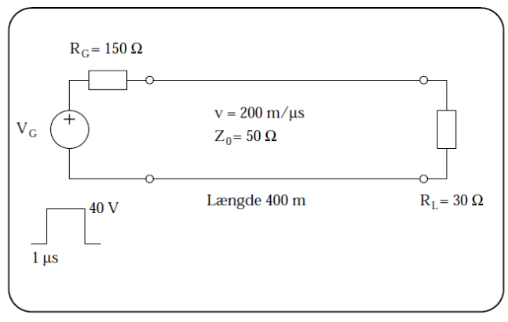
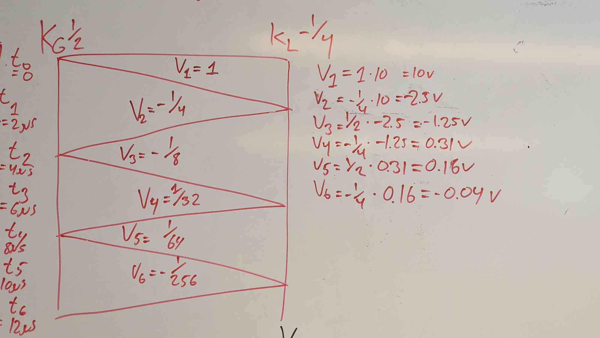
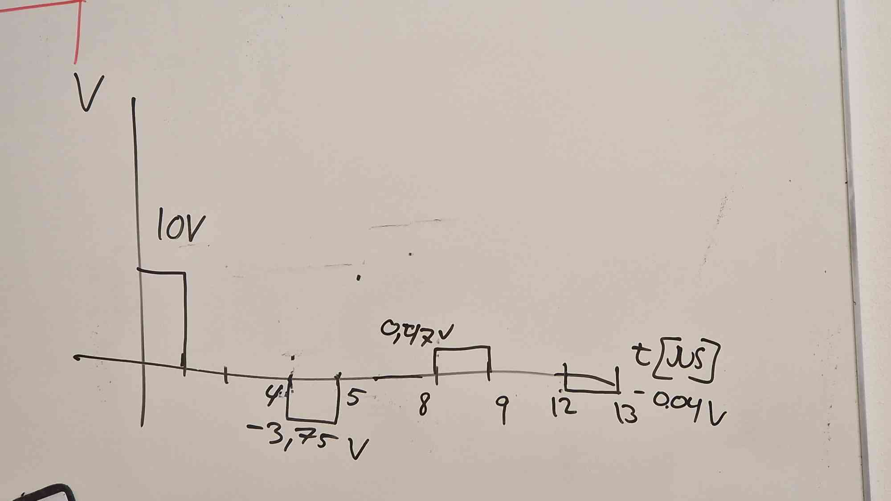
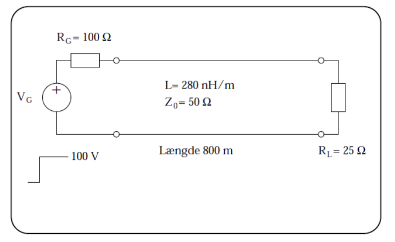
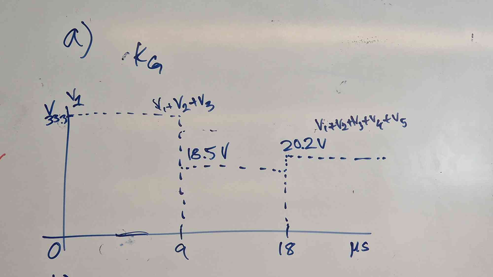
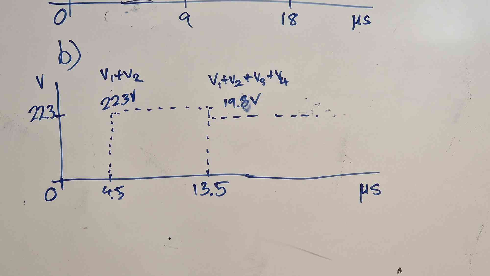
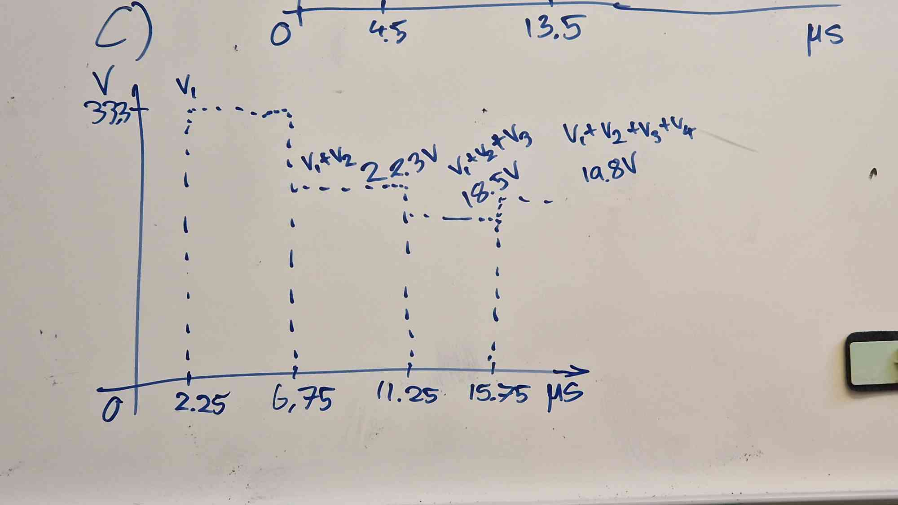

# High speed electronics in practice - exercises for lecture 7

## Exercise 7.1

In the transmission line setup shown in the figure, the generator provides a
voltage pulse of 40 V with a duration of $1 \,\mathrm{\mu s}$. The cable is
lossless and has a characteristic impedance of $50 \,\mathrm{\Omega}$. The
generator resistance is $150 \,\mathrm{\Omega}$, and the load resistance is $30
\,\mathrm{\Omega}$ as shown in the figure below.

a. Determine the reflection coefficients KL and KG, as well as the amplitude of the first incident voltage pulse, V+.

$$
k_L = \frac{R_L - z_0}{R_L + z_0} = -\frac{1}{4} \\
k_G = \frac{R_G - z_0}{R_G + z_0} = \frac{1}{2} \\
V^+ = \frac{z_0}{R_G + z_0} V_G = 10 \,\mathrm{V}
$$

b. Draw a reflection diagram for the voltage on the cable.
The diagram should be normalized with respect to V+ and the axes should be labeled with the values for time and distance.
The diagram should include 3 incident and 3 reflected signals, each represented by the normalized voltage.

$$
\Delta t = \frac{l}{v} = 2\,\mathrm{\mu s}
$$

$$
V_1 = 10 \cdot 1 = 10\,\mathrm{V} \\
V_2 = 10 \cdot V_1 k_L = -\frac{1}{4} \,\mathrm{V} \\
V_3 = 10 \cdot V_2 k_G = -\frac{1}{8} \,\mathrm{V} \\
V_4 = 10 \cdot V_3 k_L = \frac{1}{32} \,\mathrm{V} \\
V_5 = 10 \cdot V_4 k_G = \frac{1}{64} \,\mathrm{V} \\
V_6 = 10 \cdot V_5 k_L = -\frac{1}{256} \,\mathrm{V} \\
$$

c. Draw the resulting waveform for the voltage immediately to the right of the generator resistance.

The voltages are calculated based on the reflection diagram, adding the incident and reflective wave at each reflection time.

## Exercise 7.2

In the setup shown below, the generator provides a step function of 100 V. Solve the exercise using a
reflection diagram that includes 2 incident and 2 reflected waves.

a. Sketch the voltage waveform immediately to the right of the generator resistance.

$$
v = \frac{z_0}{L} = 178.5 \mathrm{e}{6} \,\mathrm{\frac{m}{s}} \\
V^+ = \frac{z_0}{R_G+z_0} V_G = 33.3 \,\mathrm{V} \\
k_L = \frac{R_L - z_0}{R_L + z_0} = -0.3 \\
k_G = \frac{R_G - z_0}{R_G + z_0} = 0.3 \\
\Delta t = \frac{l}{v} = 4.5\,\mathrm{\mu s}
$$

Reflection diagram is drawn:
$$
V_1 = 33.3 \cdot 1 = 33.3\,\mathrm{V} \\
V_2 = 33.3 \cdot V_1 k_L = -11.1 \,\mathrm{V} \\
V_3 = 33.3 \cdot V_2 k_G = -3.7 \,\mathrm{V} \\
V_4 = 33.3 \cdot V_3 k_L = 1.2 \,\mathrm{V} \\
V_5 = 33.3 \cdot V_4 k_G = 0.4 \,\mathrm{V}
$$

The voltages are calculated based on the reflection diagram, adding the incident and reflective wave at each reflection time.
Since the generator voltage is DC, all $V_i$ will last until $t=\infty$.

b. Sketch the voltage waveform immediately to the left of the load resistance.

c. Sketch the voltage waveform in the middle of the cable.

d. What will be the final value of the voltage at the three locations?

Since the cable is lossless, the voltage will be the same at all three locations.
It can be calculated with circuit theory.

$$
V_{final} = 100 \cdot \frac{R_L}{R_G + R_L} = 20 \,\mathrm{V}
$$
